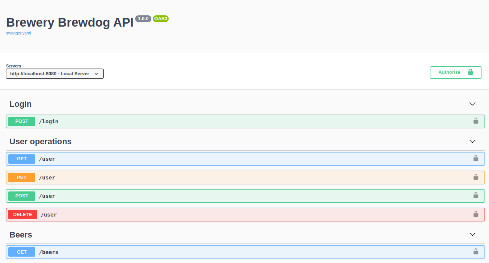

<h1 align="center">Brewery Brewdog API</h1>

- [Descrição do Projeto](#descrição-do-projeto)
- [Funcionalidades da Aplicação](#funcionalidades-da-aplicação)
- [Arquitetura do projeto](#arquitetura-do-projeto)
- [Instalação e execução](#instalação-e-execução)
- [Swagger](#swagger)
- [Tecnologias utilizadas](#tecnologias-utilizadas)
- [Pessoas Desenvolvedoras do Projeto](#pessoas-desenvolvedoras-do-projeto)
- [Licença](#licença)

## Descrição do Projeto
Brewery Brewdog API é um projeto simples que possui um CRUD completo de usuários utilizando banco de dados MySQL, e um serviço para realizar busca de cervejas na API Externa Brewery Brewdog. O projeto foi desenvolvido em PHP 7.3 no framework Lumen v8 e para o banco de dados foi utilizado o MySQL.
<br><br>

## Funcionalidades da Aplicação
- `CRUD de usuários`: O enpoint /user é usado para o CRUD de usuários, alterando apenas o tipo da requisição HTTP.
  - [POST] /user - cria um usuário no banco de dados.
  - [GET] /user - busca um usuário no banco de dados.
  - [PUT] /user - atualiza uma informação do usuário no banco de dados.
  - [DELETE] /user - apaga um usuário do banco de dados.
  
<br>

- `Autenticação`: A autenticação é realizada através do endpoint [POST] /login. Se for realizado com sucesso, é retornado um token para ser usado nas buscas das cervejas.

<br>

- `Buscar cervejas`: Para pedir uma cerveja, basta utilizar o endpoint [GET] /beers, passando na query da URL os parâmetros específico caso desejar.

<br>

- `Opções de busca de cervejas`: Parâmetros opcionais disponíveis para query do [GET]:

  - ``abv_gt`` (número). Cervejas com ABV maior que o informado.
  - ``abv_lt`` (número). Cervejas com o ABV menor que o informado.
  - ``ibu_gt`` (número). Cervejas com IBU maior que o informado.
  - ``ibu_lt`` (número). Cervejas com o IBU menor que o informado.
  - ``ebc_gt`` (número). Cervejas com o EBC maior que o informado.
  - ``ebc_lt`` (número). Cervejas com o EBC menor que o informado.
  - ``beer_name`` (string). Cervejas com o nome informado.
  - ``yeast`` (string). Cervejas com o fermento informado.
  - ``brewed_before`` (date). Cervejas criadas antes da data (yyyy-mm-dd)
  - ``brewed_after`` (date). Cervejas criadas após esta data (yyyy-mm-dd)
  - ``hops`` (string). Cervejas com o lúpulo informado.
  - ``malt`` (string). Cervejas com o malte informado.
  - ``food`` (string). Cervejas com a comida fornecida.
  - ``ids``	(string id|id|...). Cervejas com os ids fornecidos.
<br>

## Arquitetura do projeto

O projeto está estruturado na padrão MVC com Services e Repositories. Isso significa que, foi utilizado a estruturação padrão das pastas do MVC com duas camadas adicionais para uma melhor organização. Os services são usados para implementar as responsabilidades de cada serviço, e os repositories, os métodos de comunicação com o banco de dados. Juntamente com essa arquitetura, foi respeitado os princípios SOLID da programação, como por exemplo: Os services possuem apenas uma responsabilidade. Caso um service precise realizar uma outra ação, ele deve chamar o service responsável por aquela ação (por exemplo, o service de criar um usuário, não pode também verificar no banco de dados se o usuário já existe, ele deve chamar o service que possui a responsabilidade de buscar o usuário). Ou seja:
- Os controllers possuem apenas validações, para ver se está tudo certo na requisição.
- Os services implementam responsabilidades únicas.
- Os repositories implementam métodos para se comunicar com o banco de dados.
- As models simbolizam as entidades do banco de dados.

Informações adicionais:
- Os padrões de retornos estão definidos em App\DTO.
- As exceções personalizadas são definidas em App\Exceptions.
- A personalização de exceções existentes são feitas em App\Exceptions\Handler.php
- O middleware de autenticação é definido em App\Http\Middleware\Auth.php
<br><br>

## Instalação e execução

Dentro do diretório do projeto, execute os seguintes comandos:
<br><br>

- Comando que instala as dependências necessárias do projeto
    ```bash
    composer install
    ```

- Comando que inicia o servidor de backend
    ```bash
    php -S 0.0.0.0:8080 -t public
    ```
  
Os scripts para a criação do banco de dados estão em App\database\db.sql.

## Swagger

O Swagger estará disponível através do servidor de backend, na rota /swagger/. Exemplo:
> http://localhost:8080/swagger/
<br>

<div align="center">
    
</div>

O collection do Postman para ser importado e usado no programa está na raiz do projeto.

## Tecnologias utilizadas

- Backend:
    - ``PHP 7.3``
    - ``Lumen 8``
    - ``Eloquent ORM``
- Banco de dados:
    - ``MySQL 8``
<br><br>

## Pessoas Desenvolvedoras do Projeto

Samuel Trindade Silva.
<br><br>

## Licença

Este projeto está licenciado nos termos da licença MIT.
